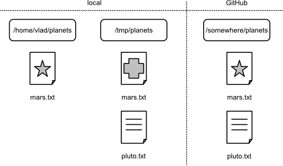
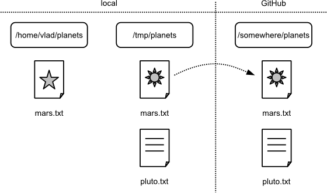

Conflicts
---------

---

#### Objectives
*   Explain what conflicts are and when they can occur.
*   Resolve conflicts resulting from a merge.

---

As soon as people can work in parallel, someone's going to step on someone else's toes. This will even happen with a single person: if we are working on a piece of software on both our laptop and a server in the lab, we could make different changes to each copy. Version control helps us manage these conflicts
by giving us tools to resolve overlapping changes.

To see how we can resolve conflicts, we must first create one. The file `mars.txt` currently looks like this in both local copies of our `planets` repository (the one in our home directory and the one in `/tmp`):

~~~
$ cat mars.txt
~~~

~~~
Cold and dry, but everything is my favorite color
The two moons may be a problem for Wolfman
But the Mummy will appreciate the lack of humidity
~~~

Let's add a line to the copy under our home directory:

~~~
$ nano mars.txt
$ cat mars.txt
~~~

~~~
Cold and dry, but everything is my favorite color
The two moons may be a problem for Wolfman
But the Mummy will appreciate the lack of humidity
This line added to our home copy
~~~

and then push the change to GitHub:

~~~
$ git add mars.txt
$ git commit -m "Adding a line in our home copy"
~~~

~~~
[master 5ae9631] Adding a line in our home copy
 1 file changed, 1 insertion(+)
~~~

~~~
$ git push origin master
~~~

~~~
Counting objects: 5, done.
Delta compression using up to 4 threads.
Compressing objects: 100% (3/3), done.
Writing objects: 100% (3/3), 352 bytes, done.
Total 3 (delta 1), reused 0 (delta 0)
To https://github.com/vlad/planets
   29aba7c..dabb4c8  master -> master
~~~

Our repositories are now in this state:

Now let's switch to the copy under `/tmp`
and make a different change there
*without* updating from GitHub:

~~~
$ cd /tmp/planets
$ nano mars.txt
$ cat mars.txt
~~~

~~~
Cold and dry, but everything is my favorite color
The two moons may be a problem for Wolfman
But the Mummy will appreciate the lack of humidity
We added a different line in the temporary copy
~~~

We can commit the change locally:

~~~
$ git add mars.txt
$ git commit -m "Adding a line in the temporary copy"
~~~

~~~
[master 07ebc69] Adding a line in the temporary copy
 1 file changed, 1 insertion(+)
~~~

giving us the following local repository state:

However, Git won't let us push this change in the temporary repository to GitHub:

~~~
$ git push origin master
~~~

~~~
To https://github.com/vlad/planets.git
 ! [rejected]        master -> master (non-fast-forward)
error: failed to push some refs to 'https://github.com/vlad/planets.git'
hint: Updates were rejected because the tip of your current branch is behind
hint: its remote counterpart. Merge the remote changes (e.g. 'git pull')
hint: before pushing again.
hint: See the 'Note about fast-forwards' in 'git push --help' for details.
~~~

Git detects that the changes made in one copy overlap with those made in the other
and stops us from trampling on our previous work.
What we have to do is pull the changes from GitHub,
[merge](../../gloss.html#merge) them into the copy we're currently working in,
and then push that.
Let's start by pulling:

~~~
$ git pull origin master
~~~

~~~
remote: Counting objects: 5, done.        
remote: Compressing objects: 100% (2/2), done.        
remote: Total 3 (delta 1), reused 3 (delta 1)        
Unpacking objects: 100% (3/3), done.
From https://github.com/vlad/planets
 * branch            master     -> FETCH_HEAD
Auto-merging mars.txt
CONFLICT (content): Merge conflict in mars.txt
Automatic merge failed; fix conflicts and then commit the result.
~~~

`git pull` tells us there's a conflict,
and marks that conflict in the affected file:

~~~
$ cat mars.txt
~~~

~~~
Cold and dry, but everything is my favorite color
The two moons may be a problem for Wolfman
But the Mummy will appreciate the lack of humidity
<<<<<<< HEAD
We added a different line in the temporary copy
=======
This line added to our home copy
>>>>>>> dabb4c8c450e8475aee9b14b4383acc99f42af1d
~~~

Our change---the one in `HEAD`---is preceded by `<<<<<<<`.
Git has then inserted `=======` as a separator between the conflicting changes
and marked the end of the content downloaded from GitHub with `>>>>>>>`.
(The string of letters and digits after that marker
identifies the revision we've just downloaded.)

It is now up to us to edit this file to remove these markers
and reconcile the changes.
We can do anything we want:
keep the change in this branch,
keep the change made in the other,
write something new to replace both,
or get rid of the change entirely.
Let's replace both so that the file looks like this:

~~~
$ cat mars.txt
~~~

~~~
Cold and dry, but everything is my favorite color
The two moons may be a problem for Wolfman
But the Mummy will appreciate the lack of humidity
We removed the conflict on this line
~~~

To finish merging,
we add `mars.txt` to the changes being made by the merge
and then commit:

~~~
$ git add mars.txt
$ git status
~~~

~~~
# On branch master
# All conflicts fixed but you are still merging.
#   (use "git commit" to conclude merge)
#
# Changes to be committed:
#
#	modified:   mars.txt
#
~~~

~~~
$ git commit -m "Merging changes from GitHub"
~~~

~~~
[master 2abf2b1] Merging changes from GitHub
~~~

Our repositories now look like this after locally merging in the changes:

so we push our merged changes to GitHub:

~~~
$ git push origin master
~~~

~~~
Counting objects: 10, done.
Delta compression using up to 4 threads.
Compressing objects: 100% (6/6), done.
Writing objects: 100% (6/6), 697 bytes, done.
Total 6 (delta 2), reused 0 (delta 0)
To https://github.com/vlad/planets.git
   dabb4c8..2abf2b1  master -> master
~~~

to get this:

Git keeps track of what we've merged with what,
so we don't have to fix things by hand again
if we switch back to the repository in our home directory and pull from GitHub:

~~~
$ cd ~/planets
$ git pull origin master
~~~

~~~
remote: Counting objects: 10, done.        
remote: Compressing objects: 100% (4/4), done.        
remote: Total 6 (delta 2), reused 6 (delta 2)        
Unpacking objects: 100% (6/6), done.
From https://github.com/vlad/planets
 * branch            master     -> FETCH_HEAD
Updating dabb4c8..2abf2b1
Fast-forward
 mars.txt | 2 +-
 1 file changed, 1 insertion(+), 1 deletion(-)
~~~

we get the merged file:

~~~
$ cat mars.txt 
~~~

~~~
Cold and dry, but everything is my favorite color
The two moons may be a problem for Wolfman
But the Mummy will appreciate the lack of humidity
We removed the conflict on this line
~~~

We don't need to merge again because GitHub knows someone has already done that.

Version control's ability to merge conflicting changes
is another reason users tend to divide their programs and papers into multiple files
instead of storing everything in one large file.
There's another benefit too:
whenever there are repeated conflicts in a particular file,
the version control system is essentially trying to tell its users
that they ought to clarify who's responsible for what,
or find a way to divide the work up differently.

---

#### Key Points
*   Conflicts occur when two or more people change the same file(s) at the same time.
*   The version control system does not allow people to blindly overwrite each other's changes.
    Instead, it highlights conflicts so that they can be resolved.

---

#### Follow-up Challenges
Clone the repository created by your instructor.
Add a new file to it,
and modify an existing file (your instructor will tell you which one).
When asked by your instructor,
pull her changes from the repository to create a conflict,
then resolve it.

What does Git do when there is a conflict in an image or some other non-textual file that is stored in version control?
